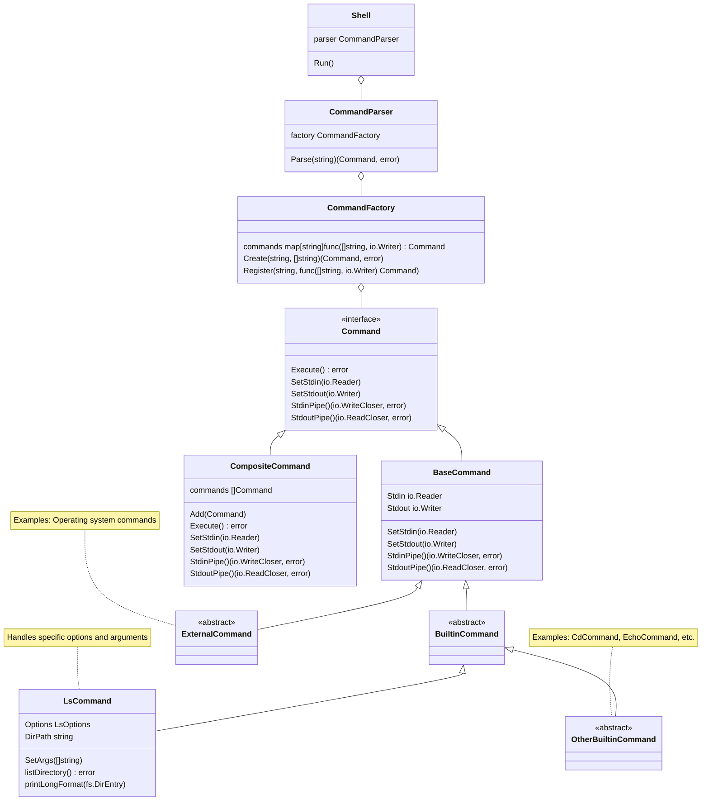

<div align = "center">

<h1><a href="https://github.com/sanurb/go-shell">go-shell</a></h1>

<a href="https://github.com/sanurb/go-shell/blob/main/LICENSE">
 </a>

<a href="https://github.com/sanurb/go-shell/graphs/contributors">
 </a>

<a href="https://github.com/sanurb/go-shell/stargazers">
</a>

<a href="https://github.com/sanurb/go-shell/network/members">
 </a>

<a href="https://github.com/sanurb/go-shell/watchers">
 </a>

<a href="https://github.com/sanurb/go-shell/pulse">
 </a>


<h3>Short Sweet Headline 🎇🎉</h3>

<figure>
  
  <br/>
</figure>

</div>

go-shell is a simple command-line shell built with Go that allows developers and enthusiasts to explore and execute built-in and external commands efficiently.

<!-- START doctoc generated TOC please keep comment here to allow auto update -->
<!-- DON'T EDIT THIS SECTION, INSTEAD RE-RUN doctoc TO UPDATE -->
## Table of Contents

- [✨ Features](#-features)
- [⚡ Setup](#-setup)
  - [⚙️ Requirements](#-requirements)
  - [💻 Installation](#-installation)
- [🚀 Usage](#-usage)
- [🏗️ What's Next](#-whats-next)
  - [✅ To-Do](#-to-do)
- [🧑‍💻 Behind The Code](#-behind-the-code)
  - [🌈 Inspiration](#-inspiration)
  - [💡 Challenges/Learnings](#-challengeslearnings)
- [📑 Useful Resources](#-useful-resources)

<!-- END doctoc generated TOC please keep comment here to allow auto update -->

## ✨ Features

- Built-in commands like `exit`, `echo`, `pwd`, `cd`, `ls`, and `type`.
- Supports execution of external commands available in the `PATH`.
- Simple and intuitive interface.
- Lightweight and fast, leveraging Go's concurrency model.

## ⚡ Setup

### ⚙️ Requirements

- Go 1.22 or higher
- Git

### 💻 Installation

Installing go-shell is as simple as cloning the repository and running the build command!

```bash
git clone https://github.com/sanurb/go-shell
cd go-shell
go build -o go-shell main.go
```

## 🚀 Usage

```bash
USAGE:
    go-shell
Example:
    go-shell
    $ echo Hello, World!
    Hello, World!
```

## 🏗️ What's Next

Planning to add more advanced features and improvements.

### ✅ To-Do

- [x] Setup repo
- [x] Implement basic built-in commands
- [x] Support external command execution
- [ ] Add support for piping and redirection
- [ ] Enhance error handling and user feedback
- [ ] Write comprehensive tests

## 🧑‍💻 Behind The Code

### 🌈 Inspiration

go-shell was inspired by the desire to deeply understand how command-line shells work and to provide a tool that developers can use and extend. As Richard Feynman said, “What I cannot create, I do not understand”. This project embodies the philosophy that real understanding comes from building and creating.

### 💡 Challenges/Learnings

- **Challenges**: Ensuring compatibility with various external commands and handling different edge cases in command execution.
- **Learnings**: Deepened understanding of Go's `os/exec` package, process management, application of some design patterns like  factory pattern using go

**Design Decisions for Enhanced Clarity and Extensibility**

The diagram showcases a refined class structure for our interactive shell. Key decisions were made to improve code organization and maintainability:

1.  **`Command` Interface:** This establishes a contract for all commands, ensuring consistent behavior and enabling seamless addition of new commands in the future.

2.  **`BaseCommand` Class:** This provides default implementations for common `Command` methods, reducing boilerplate code in concrete command classes.

3.  **`BuiltinCommand` and `ExternalCommand`:** These abstract classes categorize commands based on their origin (internal to the shell or external system commands), enhancing clarity and separation of concerns.

4.  **`LsCommand` Specialization:** `LsCommand` is further specialized due to its unique handling of options and arguments, showcasing the flexibility of the `Command` pattern to accommodate varying command behaviors.

5.  **`CompositeCommand` for Complex Operations:** This class enables the execution of multiple commands as a single unit, promoting modularity and reusability.

6.  **`CommandFactory` for Instantiation:** This class decouples command creation from the rest of the system, allowing for easy extension and modification of command types.

7.  **`CommandParser` for Interpretation:** This class parses user input and delegates command creation to the `CommandFactory`, promoting a clean separation of responsibilities.

This structure facilitates future enhancements, such as the integration of new command types or the implementation of additional features.




### 📑 Useful Resources
- [Build your own Shell - codecrafters.io](https://app.codecrafters.io/courses/shell/overview)
- [Coding Challenges FYI](https://codingchallenges.fyi/challenges/challenge-shell/)
- [Coding a Shell using C](https://medium.com/@santiagobedoa/coding-a-shell-using-c-1ea939f10e7e)
- [Writing a simple shell in Go](https://blog.init-io.net/post/2018/07-01-go-unix-shell/)

<div align="center">

<strong>⭐ hit the star button if you found this useful ⭐</strong><br>

<a href="https://github.com/sanurb/go-shell">Source</a>
| <a href="https://linkedin.com/in/sanurb" target="_blank">LinkedIn </a>
| <a href="https://sanurb.github.io/projects" target="_blank">Other Projects </a>

</div>